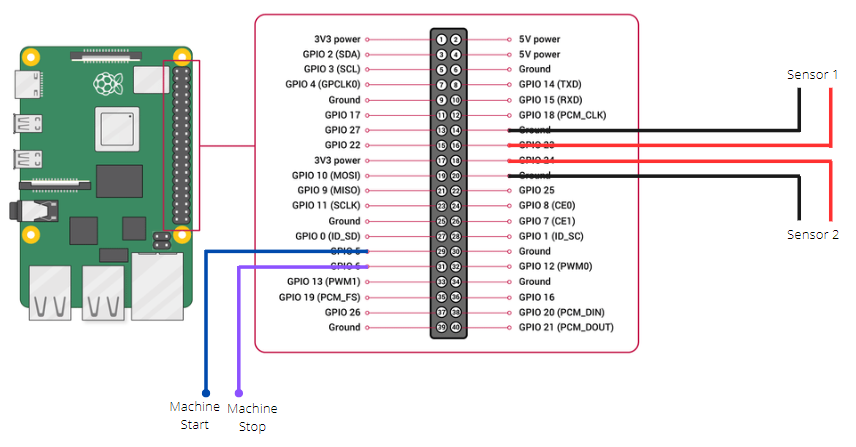

# HAWKS PROBATTER

# OS installation
You can use the [Raspberry Pi Imager](https://www.raspberrypi.com/software/) to flash the last 64-bit Bullseye ligth version (no desktop)


# Initial setup

Use raspi-config to configure the RPI
```bash
sudo raspi-config
```
- Configure the SSH interface
- Connect to your Wi-Fi network (you must have an internet connection)

## Update OS

```bash
sudo apt update
sudo apt upgrade
```
## Clone repository

```bash
git clone https://github.com/Nicolas44Hernandez/hawks_probatter.git
```

# AUTOMATIC INSTALLATION

You can use the install script:
```bash
cd hawks_probatter/setup/scripts/
sudo chmod 755 install.sh 
sudo ./install.sh
```

# MAUAL INSTALLATION

Ussing the dedicated scripts:
```bash
cd hawks_probatter/setup/scripts/
sudo chmod 755 opencv-installation.sh 
sudo chmod 755 probatter-install.sh 
sudo chmod 755 access-point-setup.sh 
```
## Set RPI as access point 
```bash
sudo ./access-point-setup.sh
```

## OpenCV installation
```bash
sudo ./opencv-installation.sh
```

## Probatter installation
```bash
sudo ./probatter-install.sh 
```
## Create log files

Log files defined in configuration file located in *server_box/server/config/logging-config.yml* must be created before launching the application

```bash
mkdir logs
mkdir logs/manager
mkdir logs/interface
touch logs/app.log 
touch logs/rest_api.log 
touch logs/manager/video.log logs/interface/video_capture.log
```

# Hardware connection
Connect machine, and the sensors to the RPI.

